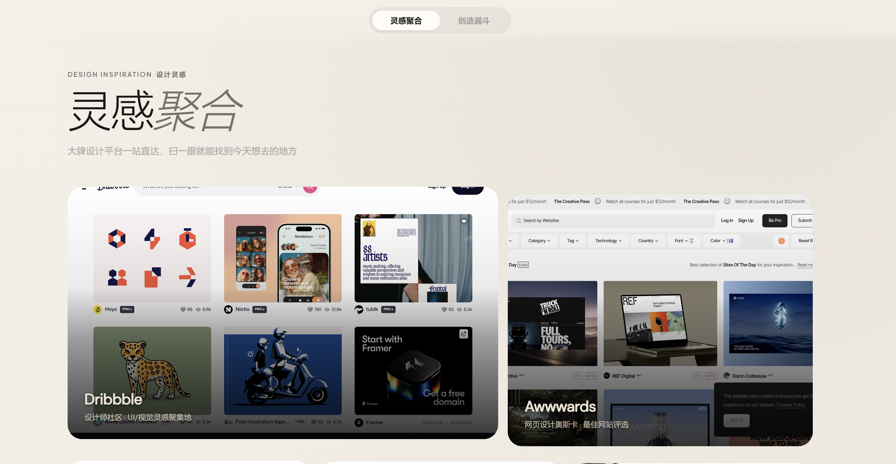
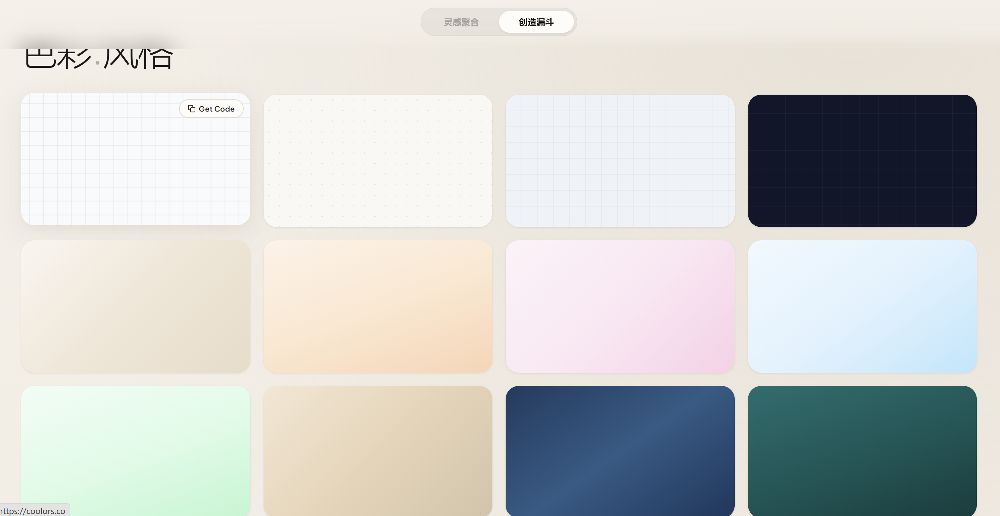
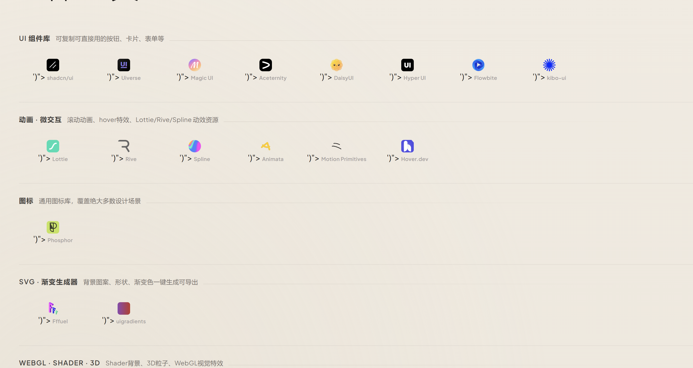

# Designer Nav

**页面一 · 灵感聚合**

**页面二 · 色彩·风格**

**页面二 · 组件·工具**

---

为 UI 设计师打造的工作灵感导航 —— 把日常工作需要的视觉灵感和工具站点聚合成一个可视化入口，打开即用。

## 页面一 · 灵感聚合

收录 13 个设计灵感站点，卡片矩阵布局，点击直达：

**Dribbble** · **Awwwards** · **Pinterest** · **Mobbin** · **Godly** · **Typewolf** · **Httpster** · **Land-book** · **Unsplash** · **Pexels** · **SaaS Landing Page** · **Page Flows** · **Fonts In Use**

## 页面二 · 创造漏斗

上半部分是配色灵感区，展示多种渐变色块，点击即可复制 CSS 代码直接用到项目里。下半部分按类别整理了常用工具站点：

- **UI 组件库** — shadcn/ui、Uiverse、Magic UI、Aceternity、DaisyUI、Hyper UI、Flowbite、kibo-ui
- **动画 · 微交互** — Lottie、Rive、Spline、Animata、Motion Primitives、Hover.dev
- **图标** — Phosphor
- **SVG · 渐变生成器** — Fffuel、uigradients
- **WebGL · Shader · 3D** — Radiant Shaders、Shader Gradient、Three.js

## 技术栈

纯 HTML + CSS + Vanilla JS，无框架依赖，单文件 < 35KB。

## 使用

浏览器直接打开 `index.html`。

## License

MIT
